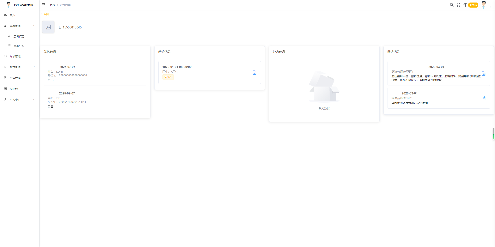
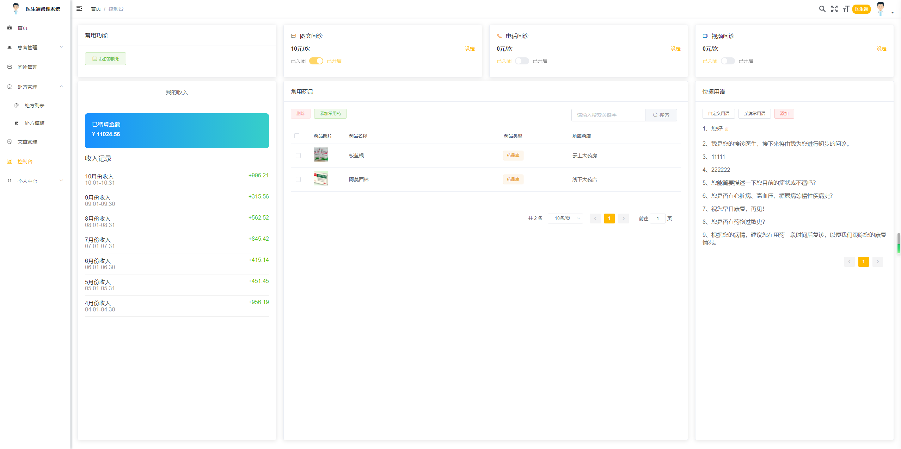
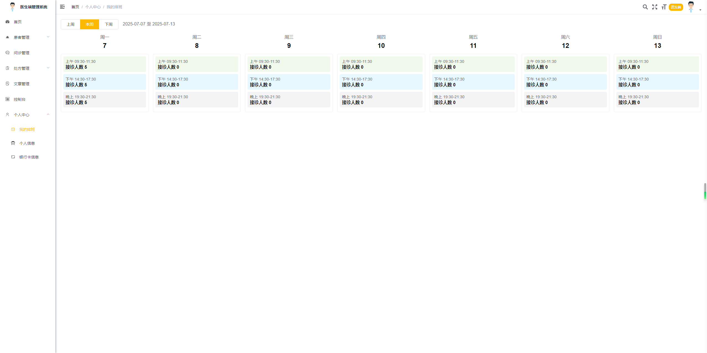
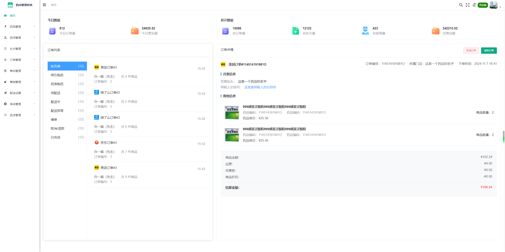
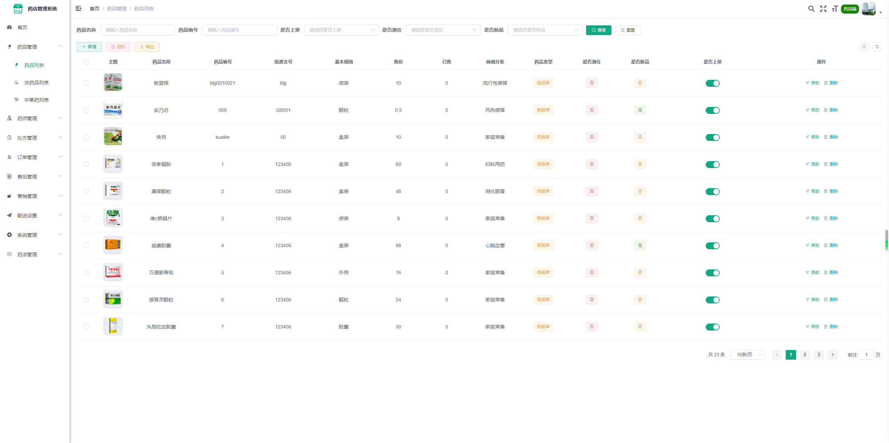
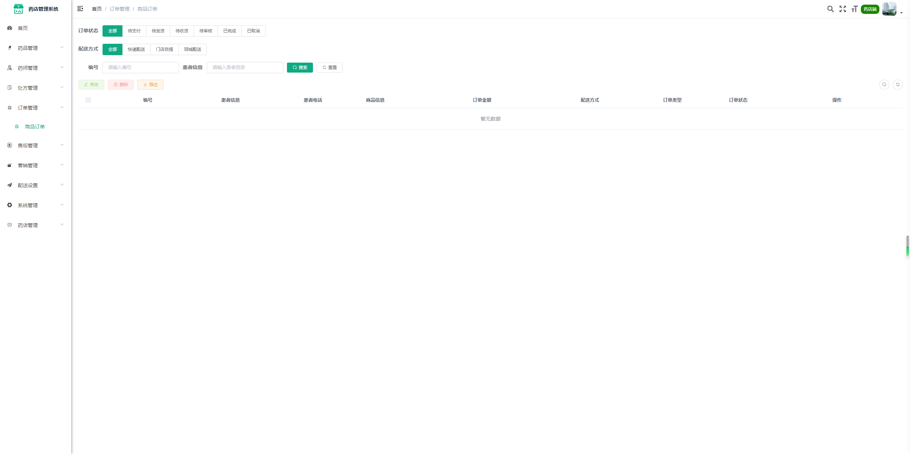
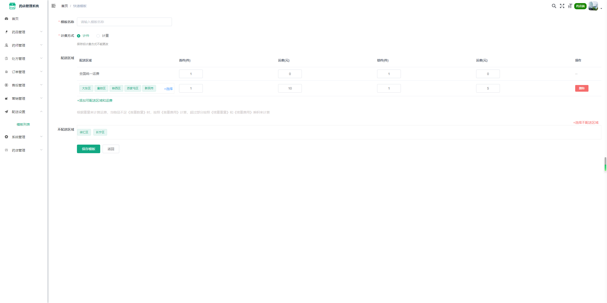

# 								华溪互联网医院系统

详细代码请访问gitee:https://gitee.com/weiyong_wise888/huaxi-internet-hospital

## 项目介绍

华溪互联网医院系统，包括与HIS对接，智慧医院、远程诊疗、网上药房、电子处方流转等子系统，满足各级别医院开展互联网诊疗；

提供全套互联网医院系统源码：总管理WEB端、医生WEB端、医生APP端、用户APP端、药房WEB端、药师APP端；

可对互联网医院系统进行功能定制开发或二次开发；

## 产品介绍

### 																			用户APP端

**首页：**

**问诊：**

### 																			医生端WEB+APP端

### 																			药师端APP

​																											**药房WEB端**

## 联系我们

**微信咨询：**

**官网了解：**http://www.huaxit.com/

**其他开源项目：**智慧物流、ERP系统、数据治理、无人看守、商城等等

